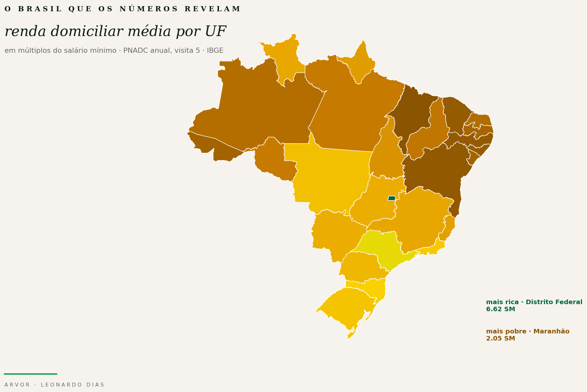

<div align="center">

# Brasil CLI

**A research-grade CLI for Brazilian public microdata.**

[](https://pypi.org/project/brasil-cli/)
[](https://pypi.org/project/brasil-cli/)
[](https://github.com/ArvorCo/PNAD/actions/workflows/ci.yml)
[](LICENSE)
[](pyproject.toml)
[](https://www.ibge.gov.br/estatisticas/sociais/trabalho/9171-pesquisa-nacional-por-amostra-de-domicilios-continua-mensal.html)



### 📊 [**Interactive data essay →**](https://brasil.arvor.co) &nbsp; · &nbsp; 🇧🇷 [Artigo PT](docs/artigo_pt.md) &nbsp; · &nbsp; 🇬🇧 [Article EN](docs/artigo_en.md)

</div>

---

## Why this exists

Brazil takes excellent photographs of itself. The IBGE's PNADC — a continuous
household survey that reaches roughly a quarter-million Brazilians each year —
is as meticulous a census as any nation conducts. And yet, between the raw
fixed-width files the government publishes and anything a citizen, journalist,
or policy analyst could read with their own eyes, there is a vast field of
friction: SAS layouts, archaic encodings, inflation deflators, nominal
minimum-wage splines, replicate weights nobody teaches. In that friction, the
country hides from itself.

This repository is an attempt to close that gap. It compresses the painful
path from official microdata into a single, auditable command-line tool
(`brasil`) whose output — CSVs, SQLite tables, JSON payloads, a rich terminal
dashboard, and the [interactive data essay](docs/index.html) in this folder —
any Brazilian (or anyone interested in the country) can read, reproduce, and
challenge. Numbers are not neutral, but auditability is. If a claim about
Brazilian inequality cannot be traced back to a bootstrap weight, a deflator,
and a specific UF row in the PNADC, it does not belong in public debate.

> **Canonical executable:** `brasil` &nbsp;·&nbsp; **Compatibility alias:** `pnad`

---

## What the project covers

### Official data sources

- **PNADC trimestral** microdata
- **PNADC anual visita 5** microdata (work + benefits + pensions + capital decomposition)
- **Censo 2022** aggregated income files
- **TSE eleitorado** open-data resources
- **BCB / IPCA** inflation series
- **BCB / minimum wage** nominal monthly series (BCB 1619)

### Core outputs

- extracted CSVs · labeled CSVs · IPCA-deflated CSVs
- SQLite databases
- terminal dashboards (pretty + JSON)
- interactive HTML essay (`docs/index.html`)

### Core interfaces

`brasil ibge-sync` · `brasil pipeline-run` · `brasil pipeline-run-anual` · `brasil query` · `brasil renda-por-faixa-sm` · `brasil dashboard`

---

## Highlights

- End-to-end pipeline from official raw files to analytic outputs.
- Both **trimestral labor-income** and **anual full household-income composition** views.
- Auto-refreshes **IPCA** and **minimum wage** references.
- Builds **SQLite** outputs for low-friction analytics and LLM-driven workflows.
- `brasil query` defaults to **read-only SQL**, safe for agentic use.
- `brasil dashboard` produces **weighted estimates**, **95% confidence intervals** (bootstrap over 200 IBGE replicate weights), and a **statistical audit seal** on every render.
- Annual dashboard includes explicit income lenses:
  - total household income
  - income excluding social benefits
  - income excluding public transfers
  - work-only income
- Visual layer (`docs/index.html`) renders the same data as 15 interactive Plotly charts with a PT/EN toggle, suitable for GitHub Pages.

---

## Install

The fastest way — install directly from PyPI:

```bash
pip install brasil-cli
```

You get both executables:

```bash
brasil --help
pnad --help        # legacy alias
```

### From source (for contributors)

```bash
git clone https://github.com/ArvorCo/PNAD
cd PNAD

python -m venv .venv
source .venv/bin/activate

pip install -r requirements.txt
pip install -e ".[dev]"
```

---

## 60-second quickstart

```bash
# 1) sync official docs + latest quarterly PNADC
brasil ibge-sync

# 2) build trimestral analytic outputs
brasil pipeline-run --raw latest

# 3) sync full scope (annual + census + TSE)
brasil ibge-sync --full

# 4) build annual visita 5 outputs
brasil pipeline-run-anual --raw latest

# 5) inspect with the terminal dashboard
brasil dashboard

# 6) render the interactive HTML essay
python docs/build_index.py
open docs/index.html

# 7) query the SQLite database (read-only by default)
brasil query \
  --db data/outputs/brasil.sqlite \
  --sql "SELECT name FROM sqlite_master WHERE type='table' ORDER BY name"
```

Main generated outputs:

- `data/outputs/base_labeled_npv.csv` — trimestral, labeled, IPCA-adjusted
- `data/outputs/base_anual_labeled_npv.csv` — annual visita 5, labeled, IPCA-adjusted
- `data/outputs/brasil.sqlite` — SQLite with `base_labeled_npv` and `base_anual_labeled_npv` tables
- `docs/index.html` — static interactive essay (bilingual)
- `data/outputs/ipca.csv` — IPCA series

---

## Typical workflows

### 1. Sync official data

```bash
brasil ibge-sync                          # latest quarterly scope
brasil ibge-sync --year 2025 --quarter 3  # a specific quarter
brasil ibge-sync --year 2025 --all-in-year
brasil ibge-sync --full                   # trimestral + annual + census + TSE
```

### 2. Build trimestral PNADC outputs

```bash
brasil pipeline-run \
  --raw latest \
  --layout data/originals/input_PNADC_trimestral.sas \
  --sqlite data/outputs/brasil.sqlite
```

### 3. Build annual visita 5 outputs

```bash
brasil pipeline-run-anual \
  --raw data/raw/pnadc_anual_visita5/PNADC_2024_visita5.txt \
  --layout data/originals/pnadc_anual_visita5/input_PNADC_2024_visita5.txt \
  --sqlite data/outputs/brasil.sqlite
```

### 4. Compute income bands

```bash
# Brazil-level distribution (with bootstrap CI)
brasil renda-por-faixa-sm \
  --input data/outputs/base_labeled_npv.csv \
  --group-by pais \
  --format json

# UF ranking
brasil renda-por-faixa-sm \
  --input data/outputs/base_labeled_npv.csv \
  --group-by uf \
  --uf-order renda_desc
```

### 5. Run the dashboard

```bash
# auto-discover and combine quarterly + annual when both exist
brasil dashboard

# explicit annual view (the one that separates work from benefits)
brasil dashboard \
  --input data/outputs/base_anual_labeled_npv.csv \
  --mode anual \
  --composition-by-band \
  --dependency-ranking

# export structured JSON for downstream tools or LLMs
brasil dashboard --format json > data/outputs/dashboard.json
```

### 6. Query with SQLite

```bash
# list tables
brasil query \
  --db data/outputs/brasil.sqlite \
  --sql "SELECT name FROM sqlite_master WHERE type='table' ORDER BY name"

# top UFs by household income
brasil query \
  --db data/outputs/brasil.sqlite \
  --sql "SELECT UF_label AS uf, AVG(VD5001__rendim_domiciliar) AS renda FROM base_anual_labeled_npv GROUP BY 1 ORDER BY 2 DESC LIMIT 10"
```

### 7. Build the interactive HTML essay

```bash
python docs/build_index.py                  # rebuilds docs/index.html
python docs/build_hero.py                   # regenerates docs/assets/hero.png
python -m http.server 8000 -d docs          # preview locally
```

The generated `docs/index.html` is a self-contained bilingual essay (PT/EN
toggle) with 15 interactive Plotly charts reading the same PNADC data as the
terminal dashboard. It is suitable for GitHub Pages (`main:/docs`).

---

## Command map

| Command | What it does | Best for |
|---|---|---|
| `ibge-sync` | Sync official files and docs | keeping local raw data fresh |
| `pipeline-run` | Build trimestral outputs | labor-income workflows |
| `pipeline-run-anual` | Build annual visita 5 outputs | full household-income composition |
| `query` | Run read-only SQL on SQLite | LLMs, analysts, automation |
| `renda-por-faixa-sm` | Compute income-band distributions with CI | reporting by Brazil / UF |
| `dashboard` | Rich terminal + JSON dashboard | exploratory analysis, briefing, storytelling |
| `sqlite-build` | Rebuild a table from CSV | custom pipelines and refreshes |
| `help-legacy` | Show legacy parser help | low-level extraction tools |

---

## LLM / agent-friendly by design

This project is intentionally useful as an LLM-side tool.

- `brasil query` and `brasil dashboard` default to **JSON** output.
- SQL is **read-only by default**; writes require an explicit `--allow-write`.
- Query payloads include **sampling metadata** (CI level, replicate-weight base, method).
- The CLI hides most fragile survey mechanics (fixed-width parsing, replicate
  weighting, IPCA deflation) from the model.

The repository ships a project-local LLM skill:

- [`skills/brasil-cli-analyst/SKILL.md`](skills/brasil-cli-analyst/SKILL.md)

That skill teaches an agent when to use each subcommand without falling into
the dumbest interface for the question.

---

## Methodology notes

### Income definitions

- **Quarterly PNADC** defaults to work income (`VD4020`, fallback `VD4019`).
- **Annual visita 5** uses household total income (`VD5001`) plus source
  decomposition (`V5001A2..V5008A2`), enabling the labor-vs-benefits split
  that the quarterly survey cannot support.
- Household income distributions are aggregated through `dom_id`.

### Inflation and minimum wage

- Income is deflated with **IPCA** to a target month.
- Minimum-wage references come from **BCB series 1619**.
- If `--target` is omitted, the latest month in the IPCA series is used.

### Weights and uncertainty

- Quarterly estimates prefer `V1028` (fallback `V1027`); annual prefer `V1032`
  (fallback `V1031`).
- 95% confidence intervals use bootstrap over 200 replicate weights
  (`V1028001..V1028200` quarterly; `V1032001..V1032200` annual).
- `brasil query` does **not** infer CI for arbitrary SQL. For
  uncertainty-aware outputs, prefer `renda-por-faixa-sm --format json` or
  `dashboard --format json`.

### Read-only safety

- `brasil query` allows `SELECT`, `WITH`, `PRAGMA`, and `EXPLAIN` by default.
- Mutating SQL requires explicit `--allow-write`.

### Statistical audit seal

Every `dashboard` render prints an **audit seal** — a compact checklist that
confirms which weight column was selected, how many replicate columns were
found, whether the bootstrap CI was effective, which IPCA target month was
used, and which minimum-wage reference was applied. The seal includes a short
hash of input + target + rows + households so two observers can verify they
are looking at the same estimate.

---

## Repository layout

```text
scripts/      main CLI and data-processing logic
tests/        pytest suite (50+ tests)
skills/       project-local skills for LLM agents
docs/         technical specs, bilingual essay, HTML builder
analysis/     exploratory analysis artifacts
notebooks/    research notebooks
samples/      tiny fixtures / examples
data/         local scaffold, outputs, raw files, docs
```

Main code modules:

- [scripts/pnad.py](scripts/pnad.py) — top-level CLI, dashboards, query, sync, pipelines
- [scripts/pnadc_cli.py](scripts/pnadc_cli.py) — lower-level extraction and legacy tooling
- [scripts/npv_deflators.py](scripts/npv_deflators.py) — IPCA / deflator logic
- [scripts/layout_sas.py](scripts/layout_sas.py) — SAS layout parsing
- [docs/build_index.py](docs/build_index.py) — HTML essay generator
- [docs/build_hero.py](docs/build_hero.py) — static hero PNG generator

---

## Development

```bash
python -m pytest -q                          # run the full suite
ruff check scripts/ docs/                    # lint
black --check scripts/ docs/                 # formatting
python scripts/pnad.py --help
python -m pytest -q tests/test_dashboard.py  # dashboard tests only
```

### Zero-lint policy

This project keeps `ruff check scripts/ docs/` and `black --check` green at
all times. Info-level warnings count. No suppressions. When adding code,
first ensure `ruff --fix` yields zero issues and `black` reformats nothing.

---

## Contributing

Good contributions include:

- new survey integrations (PNADS, Censo Demográfico microdata, POF)
- more robust statistical validation
- better annual-income decomposition workflows
- dashboard refinements and new visualizations in `docs/index.html`
- documentation and examples
- performance improvements for large raw files
- decomposition of the single-file CLI into cleaner modules

Before opening a change:

1. run the relevant pytest subset
2. keep outputs reproducible (`brasil pipeline-run --raw latest` should
   produce the same files on two machines given the same raw input)
3. avoid unsafe SQL defaults
4. preserve weighted and uncertainty-aware paths

---

## Project status

Production-useful for:

- exploratory socioeconomic analysis
- journalism and data-essay workflows
- public-policy research
- state-by-state income comparisons
- LLM-assisted analysis of Brazilian official data

It is **not** an official IBGE or TSE tool. Users should still understand the
underlying survey design before publishing strong claims. Start with the
bundled [interactive essay](docs/index.html) and the
[full article (PT)](docs/artigo_pt.md) / [(EN)](docs/artigo_en.md) for a
guided, auditable reading of what the data says.

---

## Community health

- [License — MIT](LICENSE)
- [Contributing](CONTRIBUTING.md)
- [Code of Conduct](CODE_OF_CONDUCT.md)
- [Security Policy](SECURITY.md)

---

<div align="center">
<sub>Written, compiled, and maintained by <a href="https://github.com/leonardodias-arvor">Leonardo Dias</a> with support from <a href="https://github.com/ArvorCo">Arvor</a>.<br>
Data © IBGE / PNADC · Code © <a href="LICENSE">MIT</a> · Prose © <a href="https://creativecommons.org/licenses/by/4.0/">CC-BY-4.0</a></sub>
</div>
